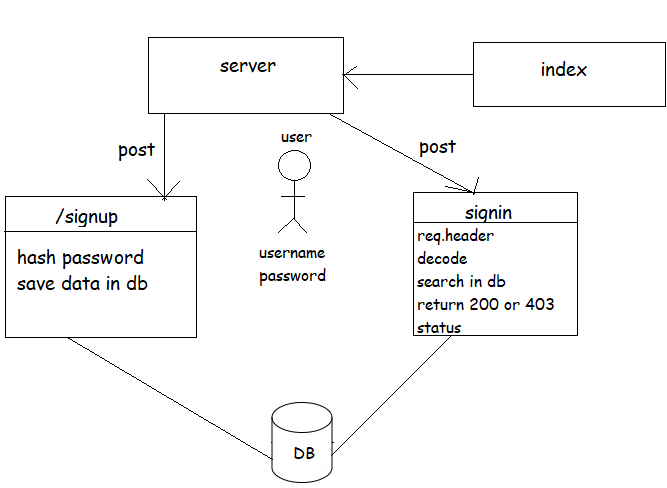

# basic-auth

Author: anwar shraideh 

# links

[repoLink](https://github.com/anwarshraideh/basic-auth.git)

[HEROKUE](https://anwar-basic-auth.herokuapp.com/)

# Setup

- Clone the repository from GitHub
- Run the command npm i express dotenv morgan base-64 bcrypt cors mongoose jest @codefellows/supergoose to install dependencies
- create .env file with PORT variable and MONGODB_URI
- Run the command npm test to test and verify the server and the midddlewares are working.

# UML Diagram

